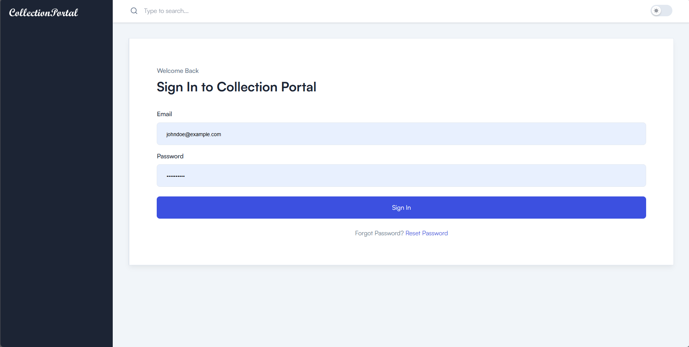
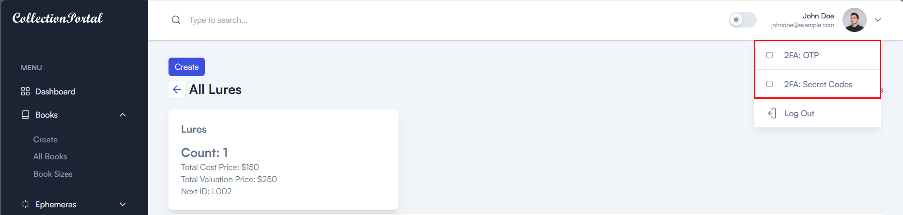
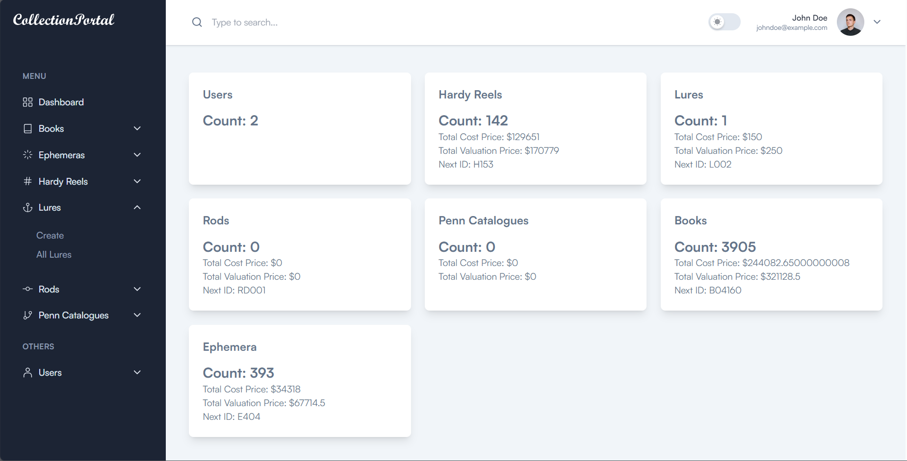
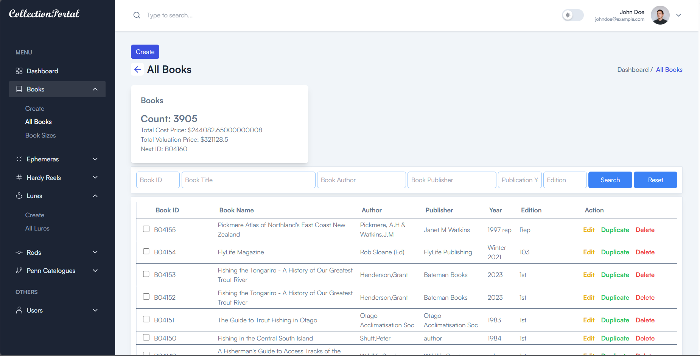

# Collection Portal (ReactJS | Typescript)

The collection portal is designed to manage the different collections digitally, including Books, Ephemeras, Hardy Reels, Lures, Rods, and Penn Catalogues. This portal has next-level user management and an authentication system with multi-authentication processes.

This is designed in Tailwind CSS, React.Js, and Typescript.

## Collection Portal (React | Typescript) - Installation

You'll need to install Node.js >=v14.16+ (Recommended Version) (NPM comes along with it) and TailAdmin uses **Vite** for frontend tooling, to peform installation and building production version, please follow these steps from below:

- Use the terminal and navigate to the project (tailadmin-react) root.

- Then run : <code>npm install</code>

- Then run : <code>npm run dev</code>

Now, in the browser go to <code>localhost:5173</code>

**For Production Build**
Run : <code>npm run build</code>

Default build output directory: /dist

This command will generate a dist as build folder in the root of your template that you can upload to your server.

### Table of Content

- Authentication with Multi Auth Validation
- User Management
- Dashboard for quick Analytics
- Books Management
- Ephemeras Management
- Hardy Reels Management
- Lures Management
- Rods Management
- Penn Catalogues Management

### Media Representation (Images)

